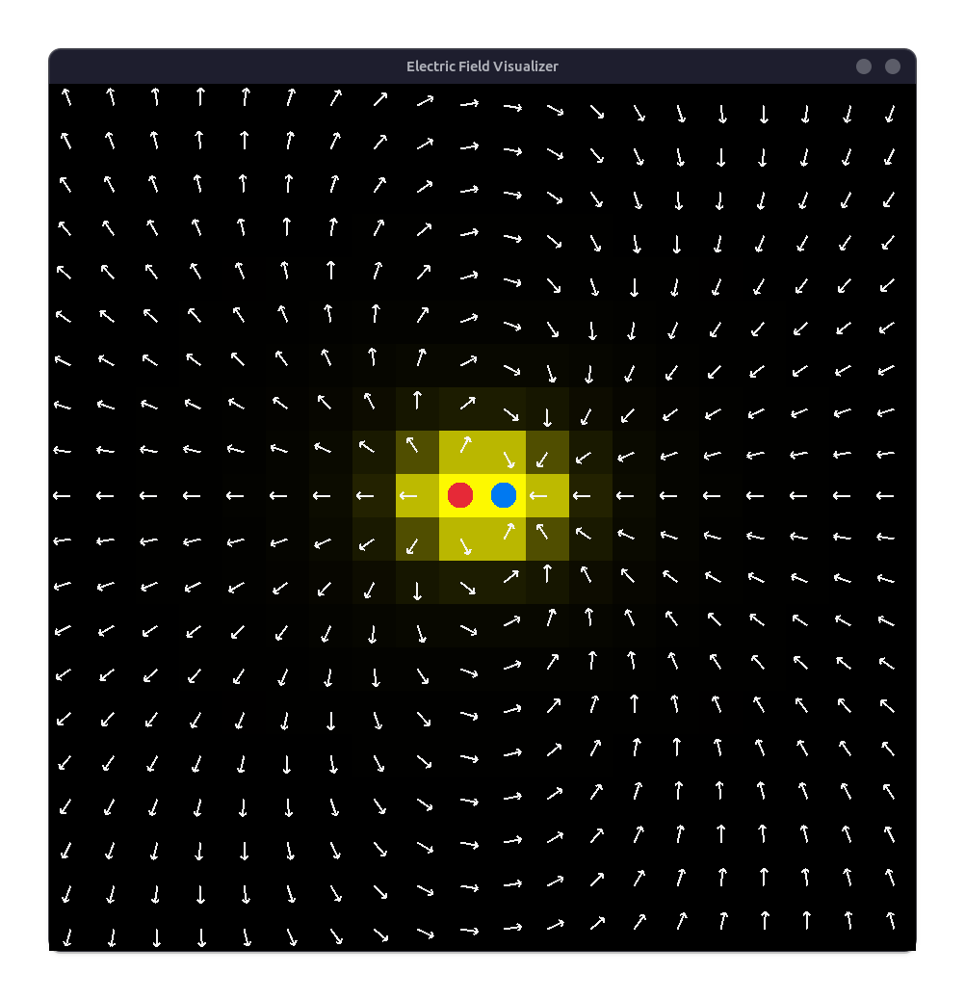
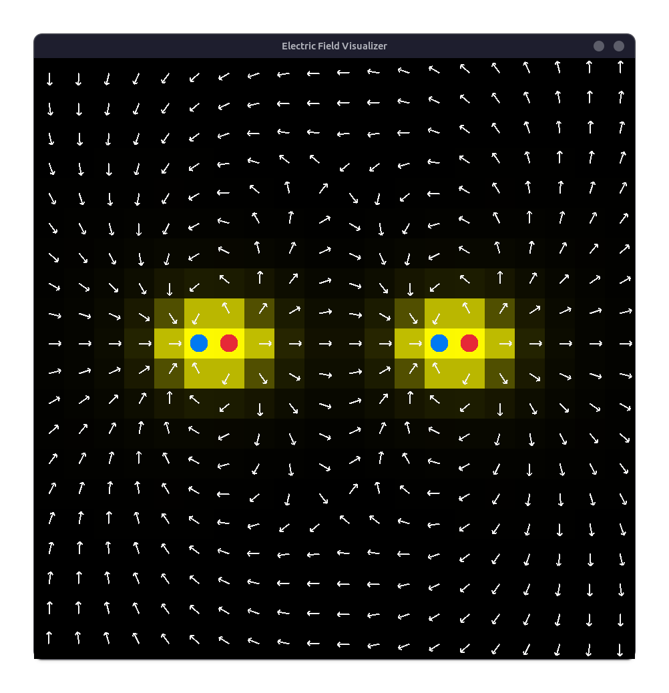
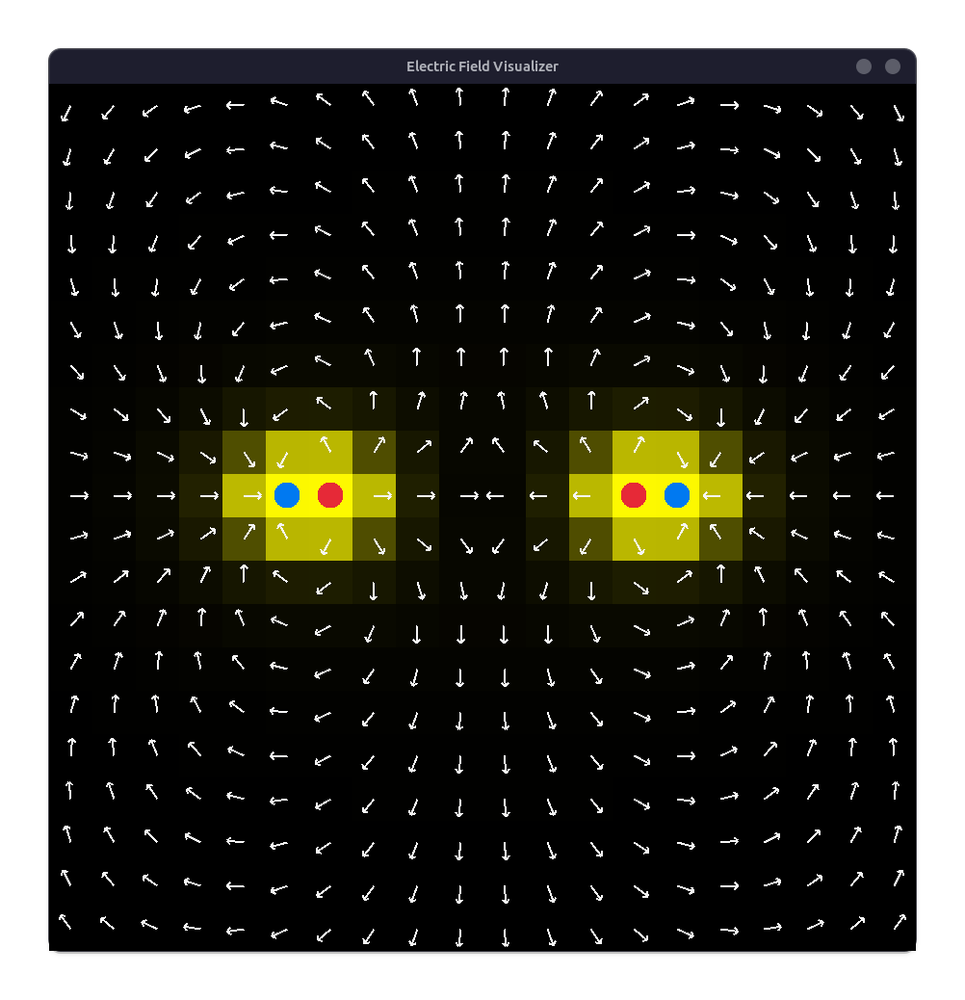

# Electric Field Visualizer

An interactive 2D electric field visualizer built in C using [raylib](https://www.raylib.com/). Place positive and negative point charges on a grid and watch the field update in real time — visualized as a heatmap and vector arrows.
## Screenshots

**Single dipole (opposite charges)**


**Two dipoles — unlike poles facing**


**Two dipoles — like poles facing**


## How it works

Each grid cell stores a charge value. Every frame, the electric field vector at each cell is computed by summing the Coulomb contributions from all non-zero charges:

$$
E = \frac {q} {r^2}
$$

direction = unit vector from charge to point

Field magnitude is normalized across the grid and mapped to a black -> yellow heatmap.

## Controls

| Input                 | Action                     |
| --------------------- | -------------------------- |
| Left click            | Place positive charge (+1) |
| Right click           | Place negative charge (−1) |
| Click existing charge | Remove it                  |
| R                     | Clear all charges          |

## Building

Requires raylib installed on your system.

```bash
gcc main.c -o efield -lraylib -lm
./efield
```

## Dependencies

- [raylib](https://www.raylib.com/) — graphics and input
- Standard C: `math.h`, `stdlib.h`, `string.h`, `stdbool.h`, `time.h`